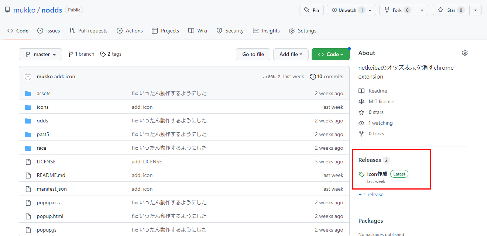
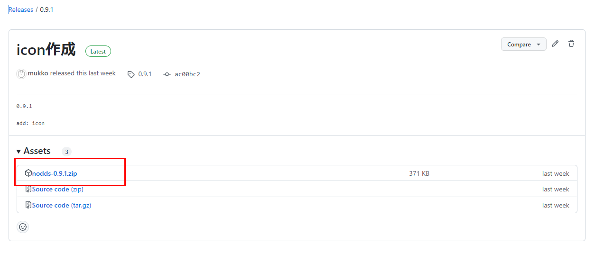
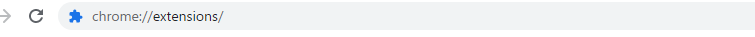
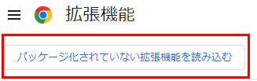
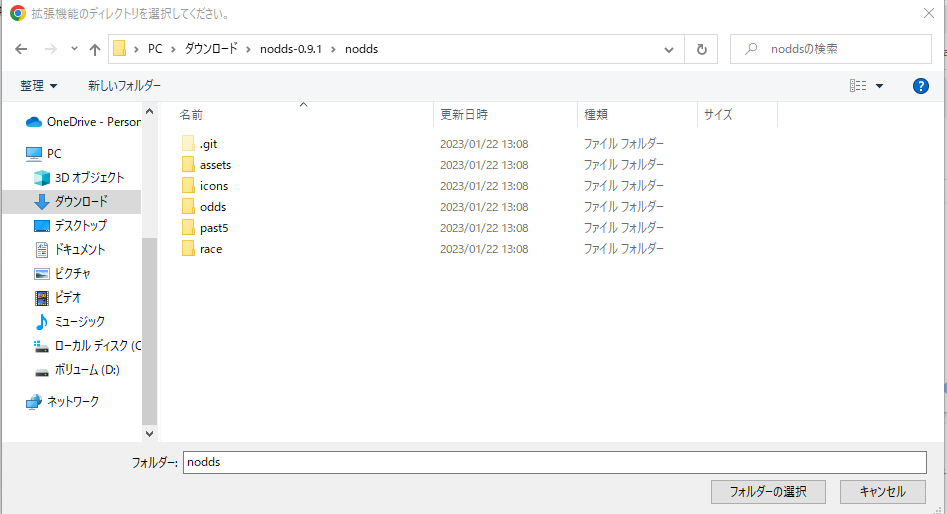
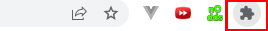

# インストール方法（詳細版）

## 1. zipでダウンロード

以下の `Release` というところの最新版をクリック  

リリースページに飛ぶので、以下の部分からzipファイルをダウンロード  

## 2. chromeの拡張機能画面を開く

検索窓に `chrome://extensions/` と入力して拡張機能画面を開く  

## 3. デベロッパーモードを有効化

非公式なエクステンションのため、これを有効にしないとインストールできないので。画面上部右のスイッチを以下の状態にする  

## 4. ダウンロードしたファイルを解凍して読み込む

画面左上の `パッケージ化されていない拡張機能を読み込む` をクリック

ここを読み込む  

## 5. 拡張機能に並んでいなかった場合

検索窓横のパズルのピースを押し、 `nodds` のピン止めを有効にするとブラウザ上に並ぶようになります

